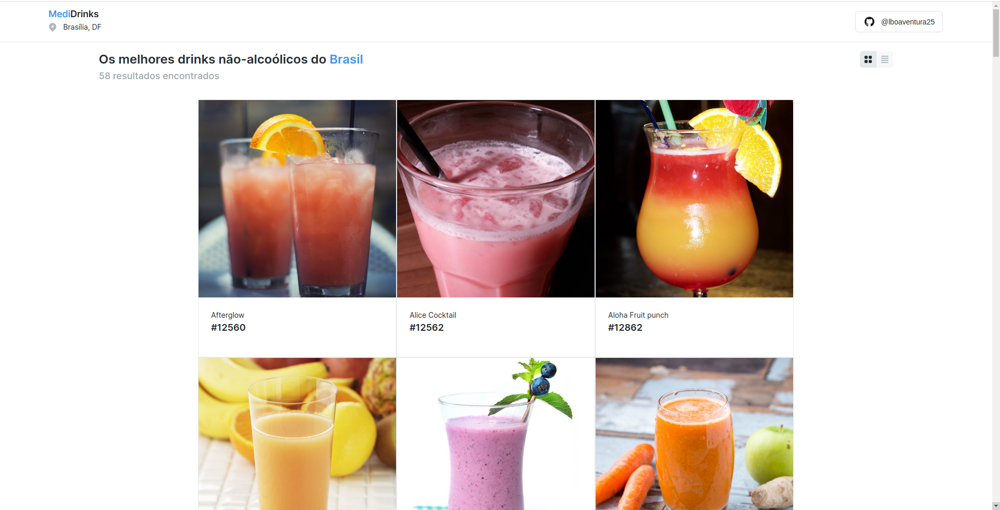
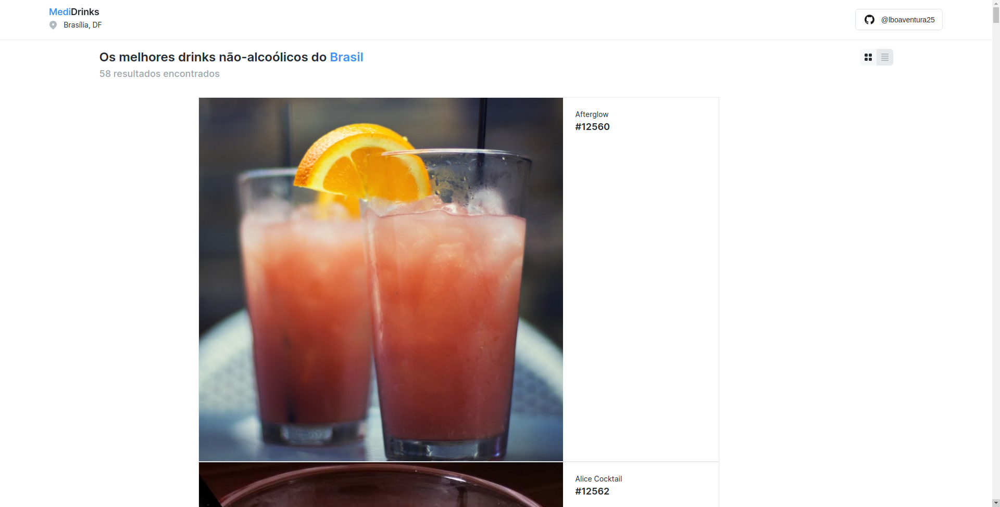
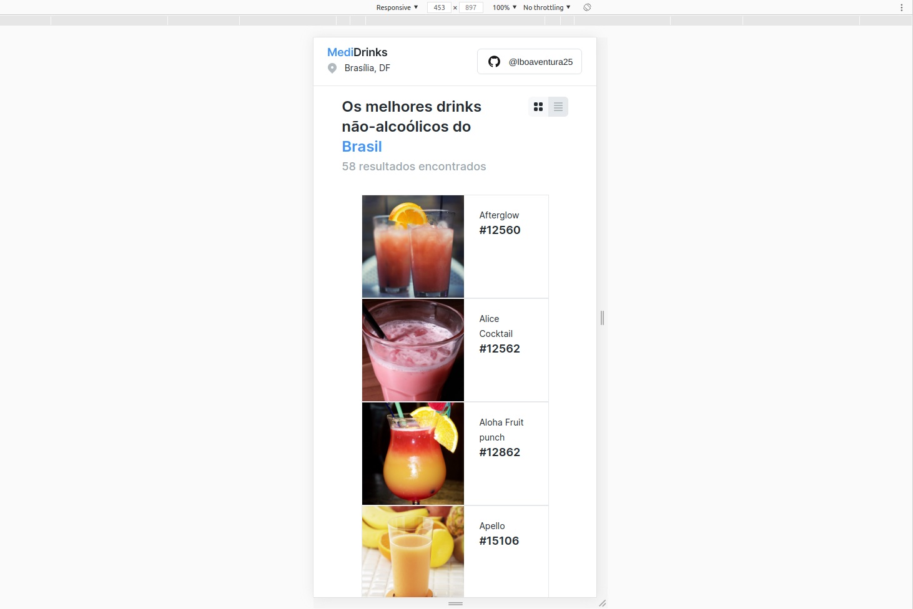
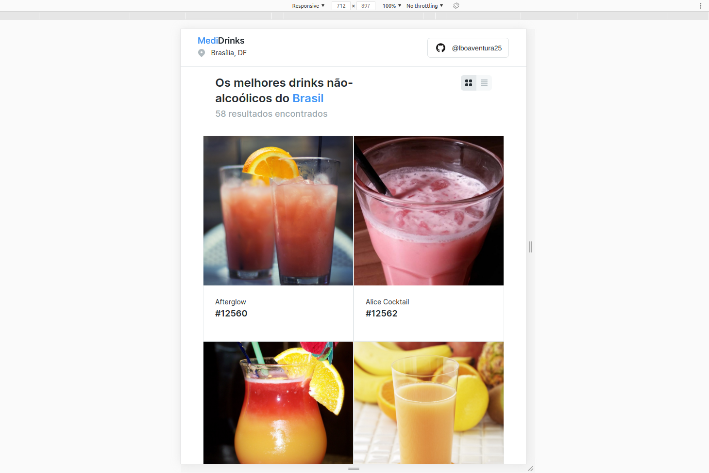
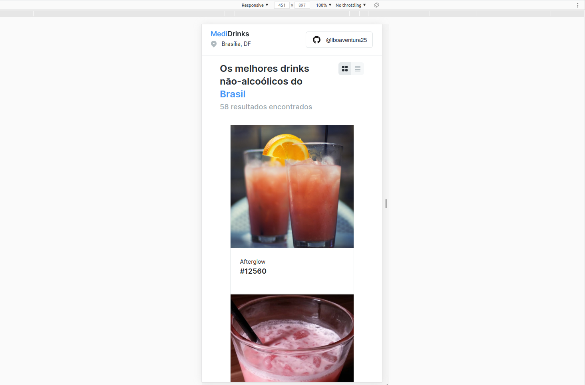
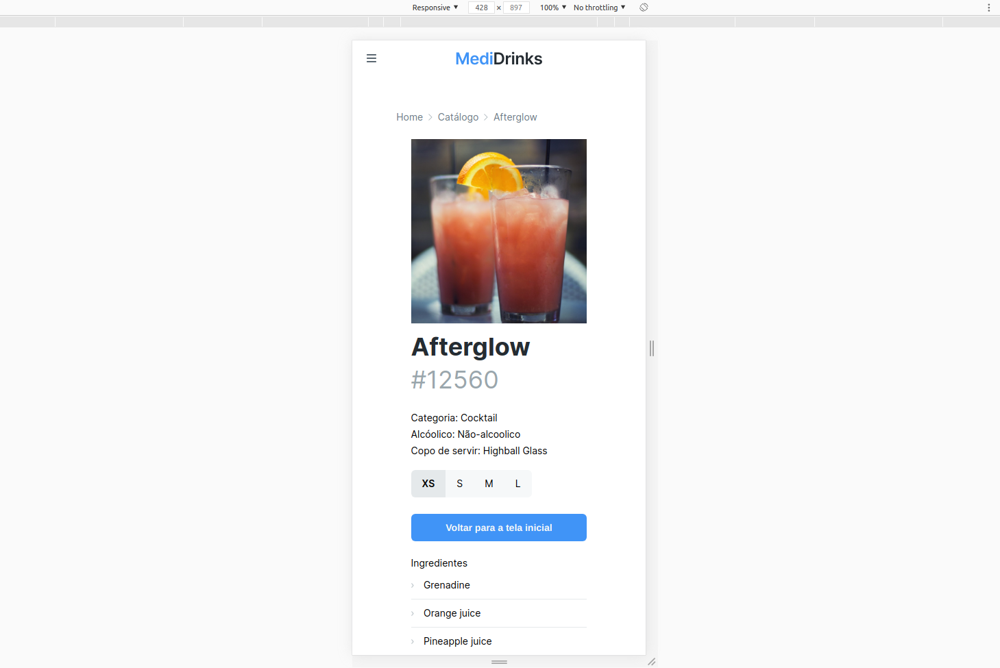
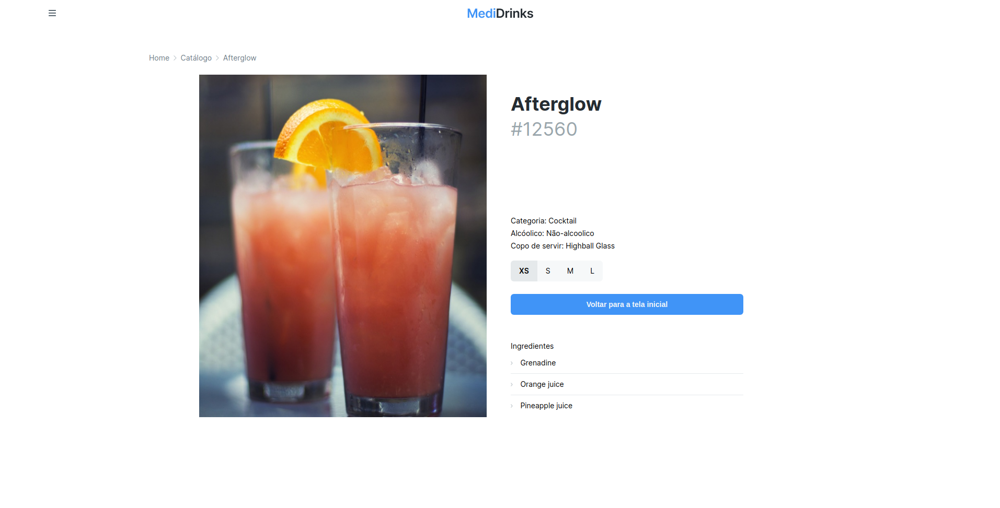

# Desafio técnico - MediPreço

<p justify='align'>&emsp; Repositório para desenvolvimento da interface disponível no Figma para o desafio técnico da MediPreço durante o processo seletivo.</p>

<p justify='align'>&emsp; É possível ver o projeto rodando clicando em https://lucas-medipreco-desafio-tecnico.netlify.app/.</p>

<p justify='align'>&emsp; As páginas são totalmente responsivas e pensadas para atender a todos os tipos de sistema operacional.</p>

## Imagens do Projeto

<p justify='align'>&emsp; Imagem da tela cheia com a opção de disposição em formato de linhas e colunas.</p>



<p justify='align'>&emsp; Imagem da tela cheia com a opção de disposição em linha das bebidas.</p>



<p justify='align'>&emsp; Imagem da tela em um celular com responsividade no formato em linha.</p>



<p justify='align'>&emsp; Imagem da tela em um tablet com responsividade no formato em linhas e colunas.</p>



<p justify='align'>&emsp; Imagem da tela mobile com responsividade no formato em coluna.</p>



<p justify='align'>&emsp; Imagem da tela mobile dos detalhes dos drinks com responsividade.</p>



<p justify='align'>&emsp; Imagem da tela dos detalhes dos drinks no computador.</p>



## Como rodar o projeto
- Clone o repositório
```
git clone https://github.com/lboaventura25/desafio-tecnico-medipreco.git
```

- Entre no diretório do repositório clonado
```
cd desafio-tecnico-medipreco
```

- Instale as dependências do projeto
```
npm install
```

- Compilar para desenvolver com hot-reload
```
npm run serve
```

- Compilar bundle para produção na pasta /dist
```
npm run build
```

